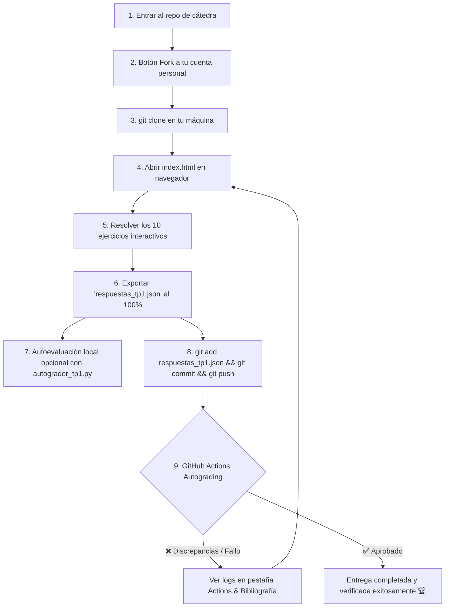

# 📚 Guía de Estudio y TP N° 1: Introducción a los Sistemas Operativos
### Cátedra: Teoría de Sistemas Operativos (TSO) — Ciclo Lectivo 2026
**Universidad Nacional de Jujuy (UNJu) — Facultad de Ingeniería**  
**Docente Responsable:** Ing. María Fernanda Vázquez  
**Jefatura de Trabajos Prácticos:** Ing. Fabio D. Argañaraz

[](https://github.com/UNJU-Teoria-de-Sistemas-Operativos/TP1/actions/workflows/classroom.yml)

---

## 📂 Estructura del Repositorio

```text
TP1/
├── .github/
│   └── workflows/
│       └── classroom.yml      # Workflow de GitHub Actions (Autograding CI disparado por push del alumno)
├── index.html                 # Aplicación web interactiva del TP1
├── styles.css                 # Diseño visual Glassmorphism Dark/Light
├── app.js                     # Motor interactivo de ejercicios y exportación JSON
├── rubric_tp1.json            # Rúbrica pública protegida con hashes criptográficos SHA-256
├── autograder_tp1.py          # Script de evaluación automática (consola, --json y GitHub Summary)
├── README.md                  # Guía de estudio, mapa bibliográfico y tutorial Git/Actions
└── .gitignore                 # Reglas de exclusión para Git
```

---

## 🎯 Objetivos de Aprendizaje
1. Comprender la definición, propósitos y funciones centrales de un **Sistema Operativo** como gestor de recursos y capa de abstracción.
2. Analizar las **Estructuras de los Sistemas de Computación**: operación de arranque (*bootstrap*), interrupciones de hardware vs. excepciones de software (*traps*), acceso directo a memoria (*DMA*) y jerarquía de almacenamiento con memoria caché.
3. Diferenciar arquitecturas de procesamiento moderno: **Multihilamiento (Hyper-Threading / SMT)** vs. **Multinúcleo (Multicore)**.
4. Distinguir formalmente entre un **Programa** (entidad pasiva en disco) y un **Proceso** (entidad activa en memoria RAM con contexto de ejecución).
5. Conocer los **Mecanismos de Protección de Hardware**: Modo Dual (**Modo Usuario** vs. **Modo Kernel**), registros base/límite y temporizador de CPU (*timer*).
6. Estudiar las **Estructuras de Kernel**: arquitecturas monolíticas, microkernel e híbridas, junto al principio de diseño de **Mecanismos vs. Políticas**.
7. Clasificar los sistemas operativos según su dominio de aplicación: Tiempo Real (*Hard/Soft*), Mainframes, Servidores, Computación Personal, Embebidos y Móviles.

---

## 📖 Mapa Bibliográfico por Capítulo y Tema

Para resolver este trabajo práctico disponen de la bibliografía oficial provista por la cátedra en el **Aula Virtual** y las diapositivas de clase dictadas por la profesora titular:

| Tema del TP | Diapositivas de Cátedra | Silberschatz (7ma Ed.) | Carretero et al. | Stallings | Tanenbaum |
| :--- | :--- | :--- | :--- | :--- | :--- |
| **Definición & Servicios del SO** | `U2-3` (Slides 3, 4, 5) | **Capítulo 1:** Sec. 1.1 y 1.4-1.8 | **Capítulo 2:** Sec. 2.1 - 2.8 | **Capítulo 2:** Sec. 2.1 | **Capítulo 1:** Sec. 1.1 |
| **Arranque (Bootstrap) e Interrupciones** | `U1` (Slides 2, 3, 10) | **Capítulo 1:** Sec. 1.2 | **Capítulo 1:** Sec. 1.3 | **Capítulo 1:** Sec. 1.4 | **Capítulo 1:** Sec. 1.3 |
| **Jerarquía de Memoria & Caché** | `U1` (Slides 4, 5) | **Capítulo 1:** Sec. 1.4 | **Capítulo 1:** Sec. 1.5 | **Capítulo 1:** Sec. 1.5 - 1.6 | **Capítulo 1:** Sec. 1.3 |
| **DMA & Entrada/Salida** | `U1` (Slides 3, 10) | **Capítulo 1:** Sec. 1.2 | **Capítulo 1:** Sec. 1.7 | **Capítulo 1:** Sec. 1.7 | **Capítulo 1:** Sec. 1.3 |
| **Modo Dual (MU vs. MK) & Protección** | `U1` (Slides 6, 7) | **Capítulo 1:** Sec. 1.5 | **Capítulo 1:** Sec. 1.8 | **Capítulo 2:** Sec. 2.4 | **Capítulo 1:** Sec. 1.1 |
| **Multihilo vs. Multinúcleo** | `U1` (Slide 8) | **Capítulo 1:** Sec. 1.3 | **Capítulo 1:** Sec. 1.9 | **Capítulo 4:** Sec. 4.2 | **Capítulo 1:** Sec. 1.2 |
| **Programa vs. Proceso** | `U2-3` (Slide 4) | **Capítulo 3:** Sec. 3.1 | **Capítulo 3:** Sec. 3.1 | **Capítulo 3:** Sec. 3.1 | **Capítulo 2:** Sec. 2.1 |
| **Estructuras de Kernel (Monolítico, Microkernel, Híbrido)** | `U2-3` (Slides 8, 17, 18) | **Capítulo 2:** Sec. 2.7 | **Capítulo 2:** Sec. 2.3.2 | **Capítulo 4:** Sec. 4.4 | **Capítulo 1:** Sec. 1.7 |
| **Tipos de SO (Batch, Time-Sharing, Tiempo Real, etc.)** | `U2-3` (Slides 10-16, 22) | **Capítulo 1:** Sec. 1.2 | **Capítulo 2:** Sec. 2.13 | **Capítulo 2:** Sec. 2.2 | **Capítulo 1:** Sec. 1.2 |
| **Mecanismos vs. Políticas & SYSGEN** | `U2-3` (Slides 19, 20) | **Capítulo 2:** Sec. 2.6 y 2.8 | **Capítulo 2:** Sec. 2.10 | **Capítulo 2:** Sec. 2.4 | **Capítulo 1:** Sec. 1.6 |

---

## 🚀 Flujo de Trabajo con Git y GitHub (Fork & Clone)

En este primer trabajo práctico, la entrega se realiza mediante la modalidad de **Fork individual** desde la organización de la cátedra:



### Paso 1: Hacer Fork del Repositorio
1. Ingresa a: [**github.com/UNJU-Teoria-de-Sistemas-Operativos/TP1**](https://github.com/UNJU-Teoria-de-Sistemas-Operativos/TP1)
2. Haz clic en el botón superior derecho **"Fork"** y luego en **"Create fork"** para generar una copia en tu cuenta de GitHub.

### Paso 2: Clonar tu Repositorio Fork
Abre tu terminal (Git Bash, PowerShell o Linux Terminal) y descarga tu copia en tu computadora:

```bash
git clone https://github.com/TU_USUARIO/TP1.git
cd TP1
```

### Paso 3: Resolver los Ejercicios en la Web Interactiva
1. Abre el archivo `index.html` en tu navegador web preferido (Google Chrome, Edge, Firefox, etc.).
2. Completa tus datos en el encabezado: **Nombre, Apellido, DNI/Legajo, Carrera y Usuario de GitHub**.
3. Resuelve los 10 ejercicios interactivos. Tu progreso se guardará automáticamente en el navegador.

### Paso 4: Exportar el Archivo de Respuestas
Al completar el 100%, pulsa el botón **"💾 Exportar Respuestas (.json)"**. Se descargará el archivo `respuestas_tp1.json`.

> [!IMPORTANT]
> Guarda o reemplaza el archivo `respuestas_tp1.json` en la raíz de la carpeta de tu repositorio clonado `TP1/`.

### Paso 5: Autoevaluación Local (Opcional)
Antes de entregar, si cuentas con Python 3 instalado, puedes verificar tu calificación ejecutando el autoevaluador de consola:

```bash
python autograder_tp1.py respuestas_tp1.json
```

Si deseas la salida estructurada en JSON:
```bash
python autograder_tp1.py respuestas_tp1.json --json
```

### Paso 6: Guardar Cambios y Subir a GitHub (Git Push)
En tu terminal dentro de la carpeta `TP1/`, ejecuta:

```bash
git add respuestas_tp1.json
git commit -m "Entrega TP1 - [Tu Nombre y Apellido]"
git push origin main
```

### Paso 7: Autoevaluación Automática en GitHub Actions (Verificación Inmediata)
Al igual que en las actividades de **Sistemas Operativos II**, este repositorio cuenta con evaluación automática en la nube:
1. Al hacer `git push origin main`, GitHub disparará automáticamente la Action **Autograding Tests - TP1**.
2. En la lista de commits de tu repositorio o en la pestaña **Actions**, observarás de inmediato el resultado:
   - `✅ (Check verde)`: Tu trabajo práctico está aprobado y la solución es correcta.
   - `❌ (Cruz roja)`: Se detectaron discrepancias conceptuales o no se encontró el archivo `respuestas_tp1.json`.
3. **¿Qué hacer si ves una cruz roja?**
   - Haz clic en la cruz roja o ve a la pestaña **Actions** y abre la ejecución de la prueba.
   - Allí encontrarás el resumen detallado en Markdown con los ejercicios con discrepancia y las páginas exactas de los libros de cátedra para repasar.
   - Ajusta tus respuestas en `index.html`, vuelve a exportar `respuestas_tp1.json`, y realiza un nuevo `git push origin main`.

---

## 🛠️ Contenido de Archivos del Trabajo Práctico

- ⚙️ `.github/workflows/classroom.yml`: Workflow de GitHub Actions para autoevaluación continua.
- 🌐 `index.html`: Aplicación web interactiva del TP1.
- 🎨 `styles.css`: Estilos visuales modernos (Glassmorphism, Dark/Light Mode, Drag & Drop responsive).
- ⚡ `app.js`: Motor de lógica interactiva, persistencia y exportación JSON.
- 🤖 `autograder_tp1.py`: Script de corrección automática para consola y GitHub Actions (con verificación SHA-256).
- 🔑 `rubric_tp1.json`: Matriz de evaluación protegida con hashes y guía bibliográfica formativa.

---
*Cátedra de Teoría de Sistemas Operativos — Universidad Nacional de Jujuy (UNJu - Facultad de Ingeniería)*
